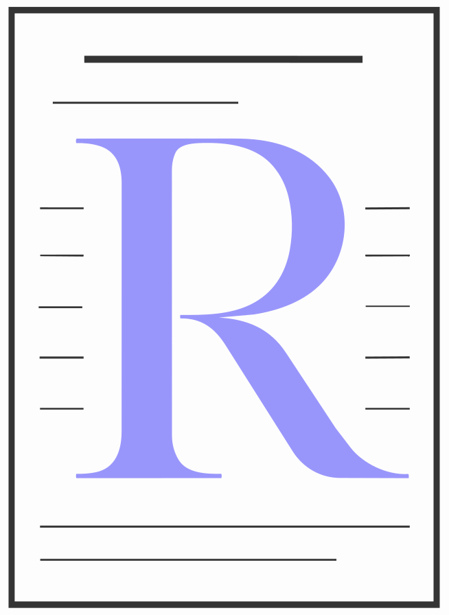

<p align="center">
  <!-- Replace with actual logo if available -->
  
</p>

<h1 align="center">Rezzy</h1>

<p align="center">
  <strong>AI-Powered Resume Tailoring & Management</strong><br/>
  Built with Next.js, Python, & LangGraph
</p>

<p align="center">
  
  
  
  
  
</p>

---

## Features

| Feature | Description |
|---------|-------------|
| **AI Resume Tailoring** | Paste a job description and AI automatically suggests targeted improvements for your resume bullets. |
| **Source Bank** | Centralized repository for all your work experiences, projects, and education. |
| **Smart Skills Engine** | AI extracts and highlights skills relevant to the target role, while ensuring no hallucinatory skills are added. |
| **LaTeX PDF Export** | Generates beautiful, ATS-friendly, professional PDF resumes using LaTeX. |
| **Interactive Step-by-Step UI** | Review AI suggestions, drag-and-drop elements, and preview your tailored resume in real-time. |
| **Cloud Sync** | Secure user authentication and data persistence via Firebase. |
| **Application Tracker** | Built-in Kanban board with drag-and-drop columns to track jobs from "Wishlist" to "Offer". |

> Stop spending hours manually editing your resume for every application. Rezzy does it in seconds.

## Tech Stack

| Layer | Technology |
|-------|-----------|
| **Frontend** | [Next.js](https://nextjs.org/) (React 19) with Tailwind CSS |
| **Backend API** | Python / [FastAPI](https://fastapi.tiangolo.com/) |
| **AI Orchestration**| [LangGraph](https://langchain-ai.github.io/langgraph/) & [LangChain](https://python.langchain.com/) |
| **LLM** | Azure OpenAI / OpenRouter |
| **Database & Auth** | [Firebase](https://firebase.google.com/) |
| **State Management**| [Zustand](https://zustand-demo.pmnd.rs/) |
| **Deployment** | Azure Container Apps (Backend) / Vercel (Frontend) |

---

## Architecture

```
├── web/                    # Next.js Frontend
│   ├── app/                # Next.js App Router (pages & API routes)
│   ├── components/         # Reusable React components (UI, modals, etc.)
│   ├── lib/                # Shared utilities, hooks, and stores (Zustand)
│   └── public/             # Static assets
├── V1/                     # Python AI Backend (LangGraph)
│   ├── src/                # Core Python logic (graph nodes, state, prompts)
│   ├── pipeline_api.py     # FastAPI entry point
│   ├── data/               # LaTeX templates and resources
│   ├── Dockerfile          # Backend containerization
│   └── requirements.txt    # Python dependencies
└── ...
```

---

## Getting Started

### Prerequisites

- [Node.js](https://nodejs.org/) 20+
- [Python](https://www.python.org/) 3.12+
- Docker (optional, for backend deployment)


### How the AI Pipeline Works
The backend uses **LangGraph** to orchestrate a sophisticated multi-step AI workflow:
1. **JD Parsing**: Extracts required skills, keywords, and seniority from the job description.
2. **Job Selector**: Matches your career history against the JD to determine which jobs and projects to include.
3. **Bullet Selector**: Evaluates every bullet point in your selected jobs and picks the ones most relevant to the target role.
4. **AI Suggestion Generator**: Suggests factual, metric-driven improvements to your bullets to increase keyword density without hallucinating experience.
5. **LaTeX Assembler**: Compiles the final tailored text into a beautiful, ATS-optimized PDF using a custom LaTeX template.
6. **QA Critic**: Automatically reviews the PDF for formatting issues (like uneven spacing or orphaned lines) and recompiles if necessary.

### Local Setup

**1. Clone the repository**
```bash
git clone https://github.com/jonahr4/Rezzy.git
cd Rezzy
```

**2. Setup Frontend (`/web`)**
```bash
cd web
npm install

# Create environment variables (Firebase, etc.)
cp .env.local.example .env.local

# Start the Next.js development server
npm run dev
```

**3. Setup Backend (`/V1`)**
```bash
cd ../V1
python3 -m venv .venv
source .venv/bin/activate
pip install -r requirements.txt

# Start the LangGraph/FastAPI backend
langgraph dev
# Or run manually with uvicorn
```

### Deployment

The AI backend is dockerized and can be deployed to Azure Container Apps using the provided NPM scripts:

```bash
# From the root directory:
npm run deploy:build   # Builds the Docker image
npm run deploy:push    # Pushes to Azure Container Registry
npm run deploy:update  # Updates the Azure Container App
```

### Environment Variables

| Variable | Description |
|----------|-------------|
| `OPENROUTER_API_KEY` | Key for AI model access |
| `NEXT_PUBLIC_FIREBASE_API_KEY` | Firebase API key |
| `NEXT_PUBLIC_FIREBASE_AUTH_DOMAIN` | Firebase auth domain |
| `NEXT_PUBLIC_FIREBASE_PROJECT_ID` | Firebase project ID |

*(Check `.env.local.example` for the full list of required variables)*

---

## License

MIT © [Jonah Rothman](https://github.com/jonahr4)
